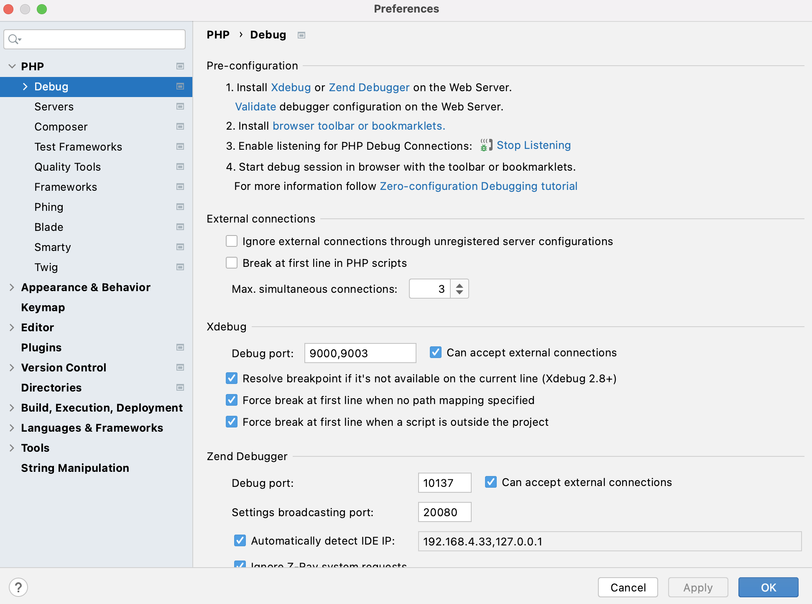
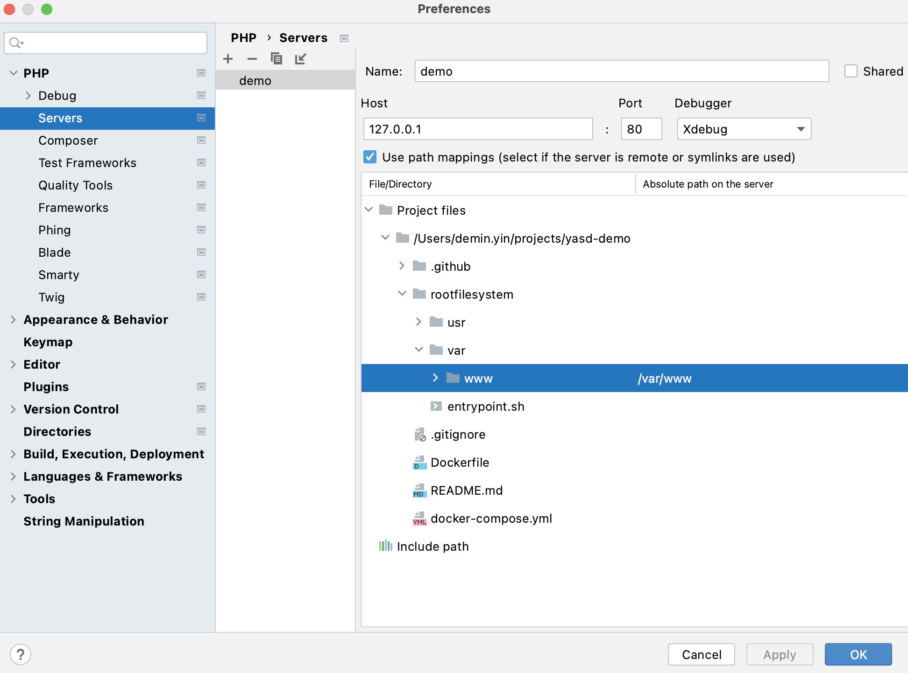

This demo is to show how to test the Swoole debugger [yasd](https://github.com/swoole/yasd) with _Phpstorm_.

# How to Use Yasd With Phpstorm

* In _Phpstorm_, please
  * Update Xdebug settings under _Languages & Frameworks_ > _PHP_ > _Debug_ > _Xdebug_:
    * Debug port: `9000`
    * Option "can accept external connections" is checked.
  * Add a new server
    * Name: demo
    * Host: 127.0.0.1
    * Port: 80
    * Debugger: Xdebug
    * Check checkbox "Use path mapping", and map the root directory of this repository to `/var/www` (the absolute path on the server).
* In _Phpstorm_, add some breakpoints in file [server.php](https://github.com/deminy/yasd-demo/blob/master/rootfilesystem/var/www/server.php).
* Enable option "Start listening for PHP Debug connections" in _Phpstorm_.
* We use port `9000` on the host for debugging. Please make sure it's not used by any other processes. You can use command `lsof -i :9000` to check which program is using port `9000`.
* Use command `docker-compose up` or `docker-compose up -d` to start the container.
  * In file [docker-compose.yml](https://github.com/deminy/yasd-demo/blob/master/docker-compose.yml), Docker environment variable `PHP_IDE_CONFIG` is set to `serverName=demo` in the container. `demo` is the server name set in _Phpstorm_.
* After the container is started, you can use command `php --ri yasd` in the container to check yasd settings.
* Visit URL `http://127.0.0.1` in your browser to start debugging.





# Commands for Local Development

```bash
# To start the container
docker-compose up

# (Optional) To build the Docker image.
docker build -t deminy/yasd-demo .
```

```bash
docker exec -ti $(docker ps -qf "name=app") env | grep PHP_IDE_CONFIG
docker exec -ti $(docker ps -qf "name=app") php --ri yasd
docker exec -ti $(docker ps -qf "name=app") cat /usr/local/etc/php/conf.d/docker-php-ext-yasd.ini
docker exec -ti $(docker ps -qf "name=app") tail -f debug.log # Only when option "yasd.log_level" is set to 0.

docker exec -ti $(docker ps -qf "name=app") sh # To get access to a shell
```
